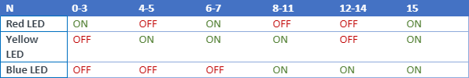

This is a simple program that i have written as part of academics in learning Mbed, 
The program is to control 3 LEDs based on the four switch states given in the table below: 
 
It is done in two fashion: 
one is by manipulating individual digital IOs and the other is by taking the switches and leds as separate buses
